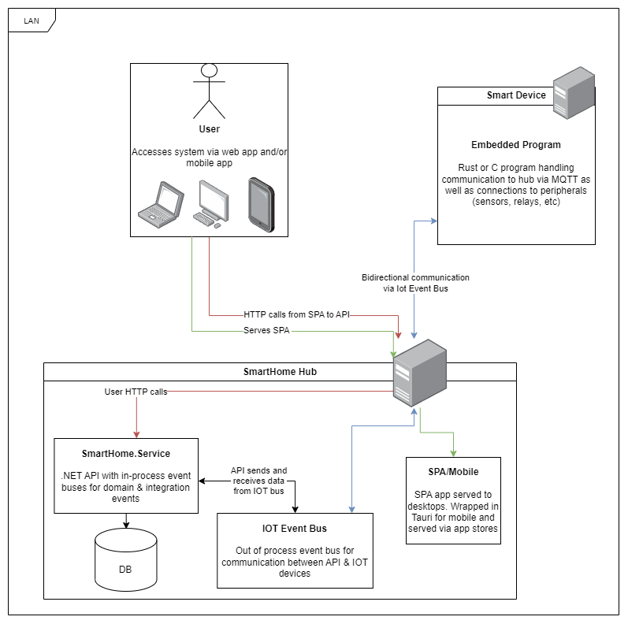
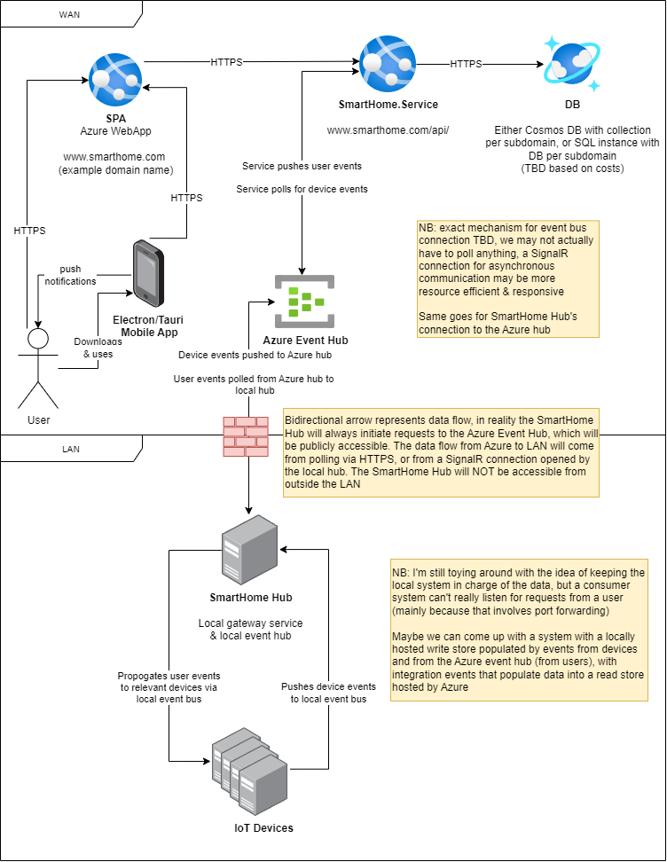

# SmartHome Architecture

[back to README.md](../README.md)

Planned architecture for the Smart Home system. This will be carried out in phases. Phase 1 is our MVP, a system that exists entirely within a user's LAN. This is a full trust architecture that is mainly going to be used for development of the SmartHome.Service application & the exact mechanisms of communication between the backend and IoT devices, as such we are not interested in authentication and authorisation. Phase 2 is the transition to a cloud hosted environment

# Phase 1

The first phase of the project aims to be as simple as possible, without worrying about the infrastructure & security concerns of an IoT application that is available over the internet.

The entire system is hosted on LAN on a user's WiFi network. A central hub, initially a Linux system on a Raspberry Pi, will host out monolith backend, a lightweight database (TBD, likely SQLite), an event bus for IoT communication (MQTT or RabbitMQ), and the SPA application.

Expanding on these components:

| Component         | Description                                                                                                                                                                                                 |
| ----------------- | ----------------------------------------------------------------------------------------------------------------------------------------------------------------------------------------------------------- |
| SmartHome Hub     | Linux based hub system, SmartHome.Service as Kestrel server, with NGINX to serve SPA & proxy /api urls to backend. This machine will also host the event bus(es) for integration events & IoT communication |
| SmartHome.Service | .NET Web API & libraries. Exposes REST API for user interaction, subscribes & publishes to the event bus for communication between smart devices                                                            |
| SPA/Mobile        | Angular SPA app, initially bundled up as mobile app using Tauri, may eventually be split out to a Xamarin/MAURI for mobile                                                                                  |
| Smart Device      | ESP32 based devices connected to LAN, communicating via the IoT Event Bus                                                                                                                                   |
| Databases         | Database per SmartHome.Service subdomain, exact technologies chosen based on what the subdomain requires (e.g. cameras need a much more sophisticated data store than light switches)                       |

# Phase 2

In phase 2 we plan to move a lot of the infrastructure into the cloud to allow users access to the system from anywhere. We will still keep the central hub, but it will act more like a gateway to remove the need for IoT devices to communicate directly over the internet, reducing the attack surface of the system. In this phase the hub will be reduced to just a gateway for pushing events to SmartHome.Service & propogating events from the service to the devices. In a later phase this hub will become a controller device, providing a touchscreen interface to manage the system from inside the home.

Here we move the SPA and the backend into Azure AppService instances, which gives us the flexibility to scale horizontally with Azure's autoscaling & loadbalancing, or even move to something like a managed Kubernetes cluster for added scalability.

TODO: clean up bidirectional arrows that don't actually represent bidirectional network connections

## Security

The security of the system is in need of further refinement and will be added to the above diagram when this happens.

Since we're targetting Azure as our cloud provider it's more than likely that authentication will be handled via some Azure identity system, using the OpenID Connect specification to provide the client (the SPA) with ID tokens and an access token for API access.

Authorization will be part of our domain model and as such included as the UserAccess module/subdomain for SmartHome.Service. Depending on the outcome of further investigation & refinement of these systems the UserAccess module will work alongside, or wrap around the identity provider & allow all important user claims to be bundled in together with ID & access tokens or inside the /userinfo endpoint.

# Phase 3

Phase 3 will build on foundations laid in the previous phase, moving to a multi-tenanted system with a focus on security, scalability and observability.
