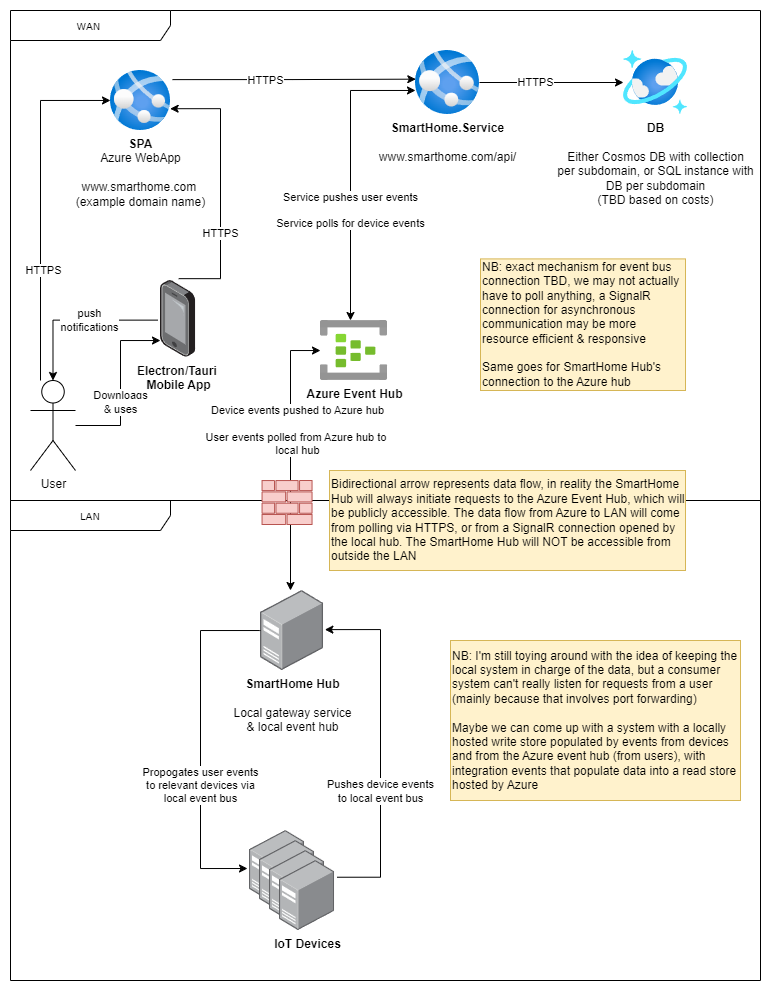

# SmartHome Architecture

[back to README.md](../README.md)

Planned architecture for the Smart Home system. This will be carried out in phases. Phase 1 is our MVP, a system that exists entirely within a user's LAN. This is a full trust architecture that is mainly going to be used for development of the SmartHome.Service application & the exact mechanisms of communication between the backend and IoT devices, as such we are not interested in authentication and authorisation. Phase 2 is the transition to a cloud hosted environment

# Phase 1

The first phase of the project aims to be as simple as possible, without worrying about the infrastructure & security concerns of an IoT application that is available over the internet.

The entire system is hosted on LAN on a user's WiFi network. A central hub, initially a Linux system on a Raspberry Pi, will host out monolith backend, a lightweight database (TBD, likely SQLite), an event bus for IoT communication (MQTT or RabbitMQ), and the SPA application.

Expanding on these components:

## SmartHome Hub

A lightweight hub system, most likely a Raspberry Pi running Ubuntu. Network config TBD but will likely use NGINX to serve the Angular SPA & proxy requests to SmartHome.Service under the same host/url

## SmartHome.Service

Kestrel/ASP hosted .NET Core API. Self Contained deployment requiring minimal deployment server configuration, allowing for easier migration to an Azure WebApp for future phases. Initially will support our custom IoT devices with communication via some out-of-process event bus, but later implementation details may change as I understand and implement the [Matter Standard](https://github.com/project-chip/connectedhomeip).

## Angular SPA

Angular application for web based access to the system. Will allow a user to use & control all configured smart devices in the home via the SmartHome.Service API.

## Mobile App

Tauri (similar to Electron) to bundle up the SPA & allow use as a mobile app. This will hopefully allow the addition of push notifications when we start to add doorbells & security systems that want to alert a user. If this proves difficult with this setup we will move towards a mobile app written in .NET MAURI.

## Smart Device

The IoT devices initially will be custom programmed ESP32 devices because that's what I have lying around. These devices will be supported or replaced by [Matter Standard](https://github.com/project-chip/connectedhomeip) devices as the standard matures and these become more readily available.

## IoT Event Bus

Bidirectional communication acheived between devices and the API via an event bus/message queue server, likely RabbitMQ.

## Databases

In this phase we will adopt SQLite databases, one per module/subdomain, for simplicity. SQLite is being chosen for the MVP because it's lightweight and easy to set up without consuming to many resources on the hub, and because we will likely move to a cloud based database like CosmosDB in future stages as we move to a serverless architecture.

# Phase 2

In phase 2 we plan to move a lot of the infrastructure into the cloud to allow users access to the system from anywhere. We will still keep the central hub, but it will act more like a gateway to remove the need for IoT devices to communicate directly over the internet, reducing the attack surface of the system. In this phase the hub will be reduced to just a gateway for pushing events to SmartHome.Service & propogating events from the service to the devices. In a later phase this hub will become a controller device, providing a touchscreen interface to manage the system from inside the home.

Here we move the SPA and the backend into Azure AppService instances, which gives us the flexibility to scale horizontally with Azure's autoscaling & loadbalancing, or even move to something like a managed Kubernetes cluster for added scalability.

## Security

The security of the system is in need of further refinement and will be added to the above diagram when this happens.

Since we're targetting Azure as our cloud provider it's more than likely that authentication will be handled via some Azure identity system, using the OpenID Connect specification to provide the client (the SPA) with ID tokens and an access token for API access.

Authorization will be part of our domain model and as such included as the UserAccess module/subdomain for SmartHome.Service. Depending on the outcome of further investigation & refinement of these systems the UserAccess module will work alongside, or wrap around the identity provider & allow all important user claims to be bundled in together with ID & access tokens or inside the /userinfo endpoint.
