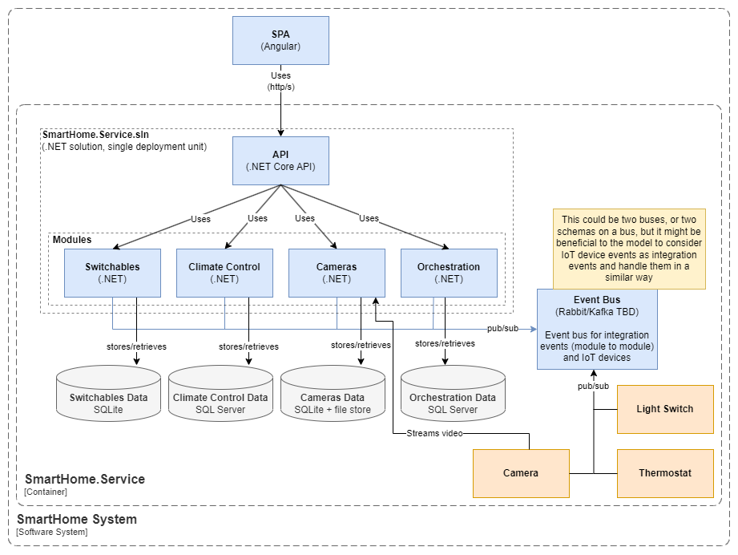
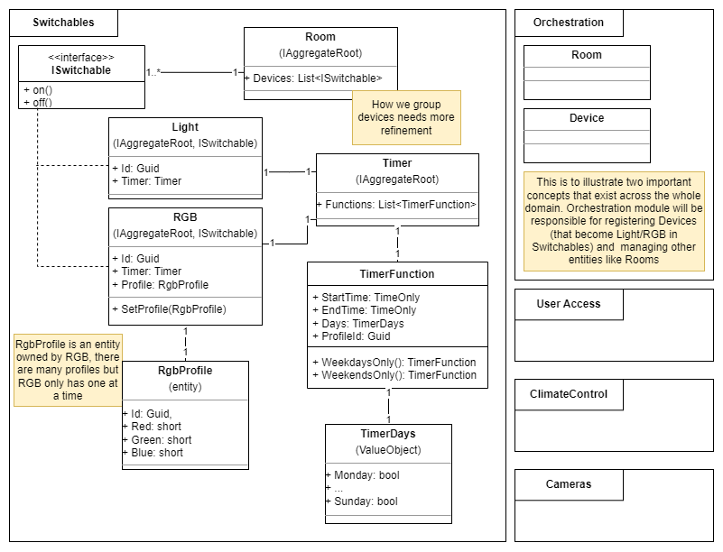

# Context Diagrams

[back to README.md](../README.md)

## About

C4 Context diagrams attempt to outline a system at different "zoom" levels. We start at C1 "system" diagram (omitted here because it's not really needed). C2 "container" diagrams break the system down into it's high level components. C3 "component" diagrams break containers down into their components (libraries, APIs, communication protocols, etc). Finally C4 "class" diagrams break components down into the classes expressed in code.

## C2 (Container)

TODO: "Management Portal" -> "SPA", add event bus or update the device -> application connection to imply that events are used here rather than http calls

## C3 (Component)

About these components:

| Component     | Description                                                                                                                                                                                                                                                                                                                                                                                                |
| ------------- | ---------------------------------------------------------------------------------------------------------------------------------------------------------------------------------------------------------------------------------------------------------------------------------------------------------------------------------------------------------------------------------------------------------- |
| SPA           | Angular SPA                                                                                                                                                                                                                                                                                                                                                                                                |
| API           | .NET Core API, set of controllers per subdomain/module, sends CQRS\* commands & queries via mediator to relevant module                                                                                                                                                                                                                                                                                    |
| Modules       | .NET Core libraries, define commands/queries to be exposed by API, modules also subscribe to integration events from other modules & smart devices                                                                                                                                                                                                                                                         |
| Data          | Data stores will be built up based on the needs of a module, so a low data module may have a small SQLite or MongoDB database for device data & config. A more data intensive module like Cameras may have multiple stores, one for device data & domain logic, another for storing video files.                                                                                                           |
| Event Bus     | Asynchronous communication between modules & devices. Exact library TBD (probably Kafka or Rabbit). Typed integration events should only be published to by the module or device that defines the event, but any module/device can subscribe to any integration event. We may implement an extra abstraction layer to map data published by smart devices to a C# type that modules can easily understand. |
| Smart Devices | (Pictured in orange) These are the physical IoT/edge devices & their embedded software that allows for physical control of the home & communication to & from the central API.                                                                                                                                                                                                                             |

\* CQRS: Command Query Responsibility Segregation

NB: The data stores, event bus & smart devices potentially belong outside the SmartHome.Service container, however this still does a decent job communicating the layout of the system.

## C4 (Class):

(Work in progress)
