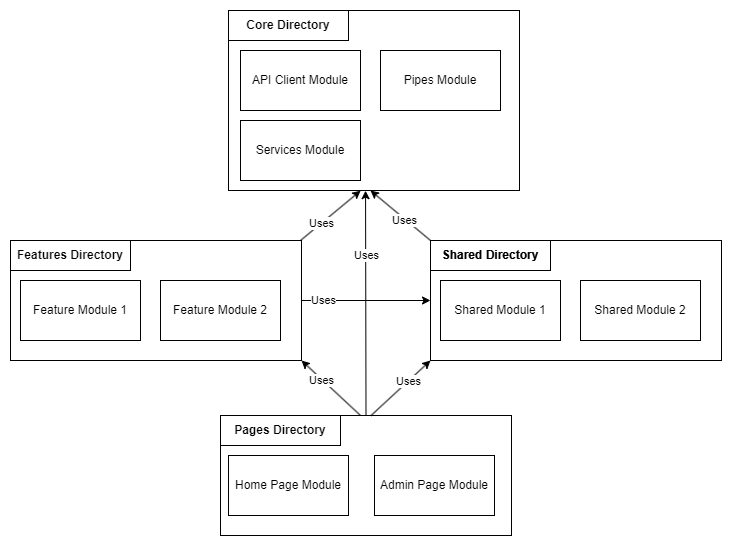

# SPA Design

[Back](../README.md)

## High Level

- Angular 15
- NSwag for auto API clients
- Fontawesome icons

## App Structure



Project is structured into following folders:

```
| app
    | Core
    | Features
    | Pages
    | Shared
```

Each folder is a collection of modules explained in more details below

| Directory | Purpose                                                                                                                                                                                                                                                                                        |
| --------- | ---------------------------------------------------------------------------------------------------------------------------------------------------------------------------------------------------------------------------------------------------------------------------------------------- |
| Core      | Services & other tools used globally or required at startup. Authentication, API contracts (NSwag clients), pipes,etc.                                                                                                                                                                         |
| Features  | Units of business logic, used to build the site's main components. Feature modules choose what they want to export & what to encapsulate. This could be a single component, a collection of components, or even services/pipes/directives if they represent a distinct piece of business logic |
| Pages     | Lazy loaded modules that represent a single route in the main app router. These modules act as a sink for other modules (they have no exports) & are solely focused on orchestration logic                                                                                                     |
| Shared    | Re-usable components, directives and any wrapped thrid party components. Each component here is a module to help keep chunk size down in our lazily loaded pages                                                                                                                               |
